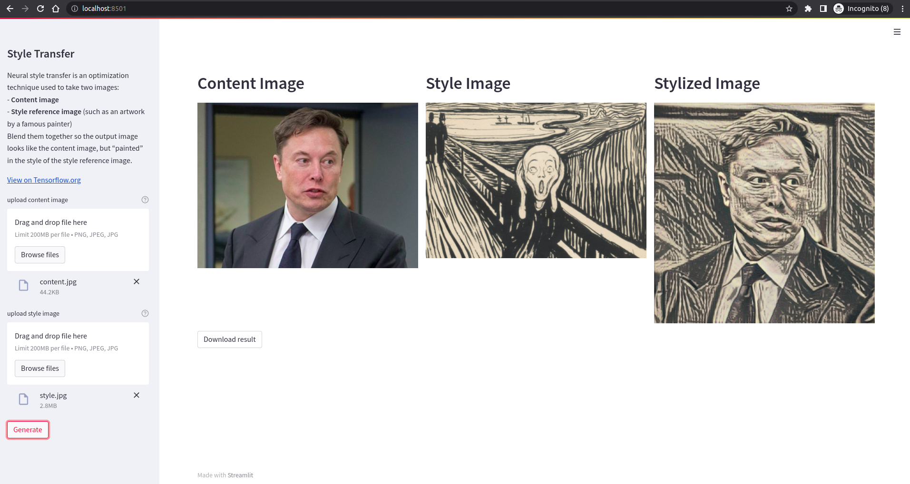

# Style Transfer web app

Streamlit web app to try Style Transfer model from [Tensorflow Hub](https://www.tensorflow.org/hub/tutorials/tf2_arbitrary_image_stylization)


## Screenshots



## Requirements

```python
matplotlib==3.5.1
numpy==1.22.3
Pillow==9.1.0
streamlit==1.8.1
tensorflow-cpu==2.8.0
tensorflow_hub==0.12.0
```

## Installation

```bash
git clone https://github.com/Otman404/style-transfer.git
cd style-transfer
pip install -r requirements.txt
streamlit run style_transfer.py
```

The app should be running in <http://localhost:8501>.
